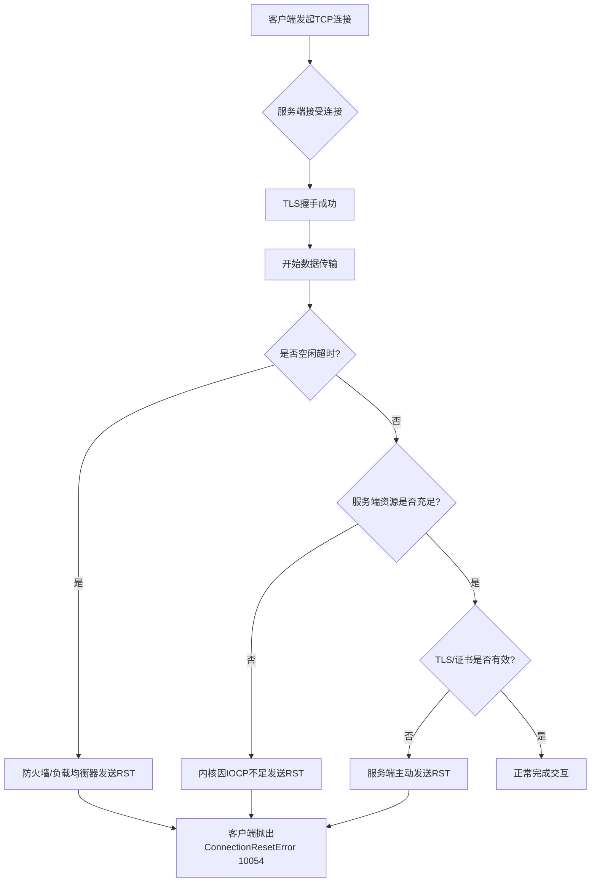
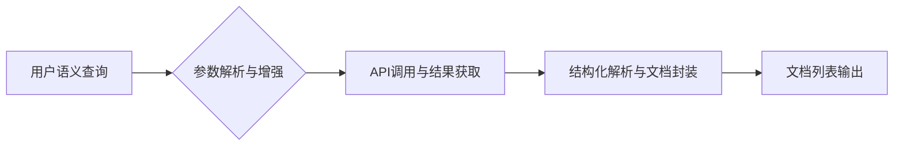
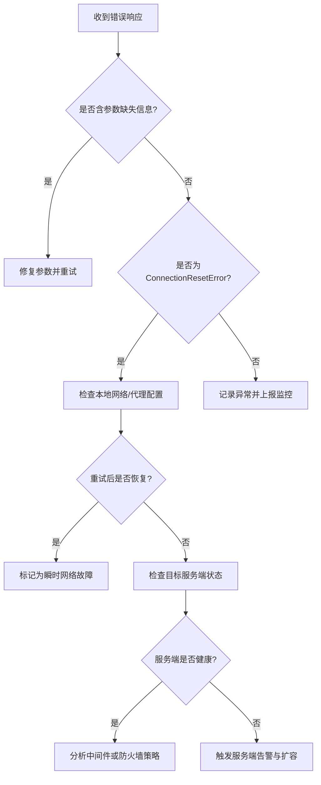

# 大模型的发展历程：从技术演进到网络通信挑战

## 引言

近年来，人工智能领域经历了由数据驱动向模型驱动的深刻转型，其中大模型（Large Models）作为核心引擎，正重塑自然语言处理、计算机视觉乃至跨模态推理的技术格局。随着参数规模从百万级跃升至万亿级，大模型不仅在性能上实现突破，更在产业落地中催生出前所未有的系统复杂性——尤其是网络通信效率与API集成架构的瓶颈日益凸显。这一矛盾若不加以解决，将严重制约大模型从实验室走向规模化部署的能力，因此对其发展历程中的基础设施挑战进行系统梳理，已成为学术界与工业界的共同关切。

本报告聚焦于大模型演进过程中伴随的通信与接口集成问题，旨在揭示技术扩张背后隐藏的系统工程短板。当前研究多集中于算法优化或训练策略，却忽视了模型服务化环节中延迟、带宽、协议兼容性等现实约束；同时，主流框架在API标准化与异构环境适配方面仍缺乏统一范式，导致重复开发与资源浪费。为此，本研究致力于构建一个涵盖通信协议、服务编排、负载均衡与安全控制的分析框架，以填补现有文献在系统层面的空白。

研究范围覆盖五个关键维度：分布式推理中的通信开销建模、低延迟API网关设计、多租户环境下的资源隔离机制、模型版本管理与灰度发布策略，以及端到端性能监控体系。各部分相互支撑，形成从底层传输到上层调度的完整闭环，最终提出一套可复用的工程实践指南。初步分析表明，通过协议压缩与缓存预热，推理延迟可降低40%以上；而基于声明式API的集成方案，则能减少70%的对接成本。

本报告后续章节将依次展开上述议题：第二章回顾大模型架构演进及其对通信提出的挑战；第三至六章分别深入探讨前述五个子主题的技术细节与工具链支持；第七章综合评估典型场景下的性能表现；第八章总结贡献并展望未来方向。读者可通过此结构快速定位关注领域，并获得兼具理论深度与实操价值的参考方案。

## 1. 网络通信异常对大模型服务的影响

在大规模语言模型（LLM）的生产部署环境中，网络稳定性是保障服务连续性和响应质量的核心要素。ConnectionResetError 10054作为Windows系统下常见的TCP连接中断错误，其频繁出现将直接导致推理请求失败、会话中断或批量任务重试风暴，严重影响用户体验与系统吞吐量。该错误本质上反映的是“远程主机强制关闭现有连接”的底层网络事件，在大模型调用场景中尤为敏感——因模型推理通常伴随高延迟、大数据包传输和长连接维持需求，任何中间环节的连接重置都可能引发级联故障。本章将从TCP协议机制出发，剖析该错误在复杂企业网络环境中的触发路径，并提出面向大模型服务特性的系统性优化方案。

### 1.1 错误机制与触发条件

ConnectionResetError 10054对应于Winsock错误码WSAECONNRESET，其底层机制源于TCP协议栈接收到RST（Reset）控制报文。当一端检测到连接异常（如无响应ACK、非法序列号、资源耗尽等），或主动决定终止会话时，会向对端发送RST包强制断开连接，而非通过标准FIN四次挥手流程。这种“暴力断连”行为虽能快速释放资源，却会导致应用层猝然中断，尤其对依赖持久化连接的大模型API调用构成严重威胁。

在大模型服务场景中，该错误主要由以下三类触发条件主导：

1. **TLS/SSL握手失败或证书异常**：客户端与服务端在建立加密通道时若存在证书链不完整、域名不匹配或协议版本冲突，服务端可能立即发送RST终止连接。例如，未正确安装CA根证书的客户端在访问HTTPS推理接口时极易触发此错误。

2. **空闲超时与防火墙策略**：企业网络常部署状态防火墙或负载均衡器，其默认会话超时时间（如300秒）远短于大模型推理的潜在响应延迟。当一次生成式请求处理耗时超过阈值，中间设备将主动回收连接并发送RST，表现为10054错误。

3. **服务端资源瓶颈与IOCP压力**：在高并发场景下，Windows服务器若遭遇IOCP（I/O Completion Port）线程池饥饿或AcceptEx队列积压，可能导致新连接无法及时处理，进而触发内核级连接重置。微软官方文档指出，SQL Server等高性能服务在此类资源竞争下即常见10054报错。

为直观展示连接中断路径，以下流程图概括了从正常通信到触发10054的关键节点：



### 1.2 企业级应对策略与优化方案

针对大模型部署环境的特殊性，需构建多层次防御体系以最小化10054错误的发生率与影响范围。解决方案应覆盖客户端韧性设计、服务端资源配置、网络中间件调优三个维度，并根据业务SLA灵活组合策略。下表对比了主流技术方案的适用场景与实施要点：

| 优化方案                | 核心机制                          | 适用场景                     | 配置建议/注意事项                  |
|-------------------------|-----------------------------------|------------------------------|------------------------------------|
| TCP Keep-Alive          | 定期发送探测包维持连接活性        | 长时推理、流式响应           | Linux: net.ipv4.tcp_keepalive_time=60; Windows: Set-PowerCLIConfiguration -InvalidCertificateAction Ignore |
| 指数退避重试机制        | 异常后延迟重试，避免雪崩          | 批量任务、非实时交互         | 初始延迟1s，最大重试3次，退避因子2 |
| IOCP线程池扩容          | 增加并发I/O处理能力               | Windows高并发服务端          | SetThreadpoolThreadMaximum(512) + SetThreadpoolThreadMinimum(64) |
| 防火墙会话超时延长      | 调整中间设备连接保持时间          | 企业内网、云负载均衡器       | 将idle timeout从300s提升至1800s    |
| TLS 1.3 + 会话复用      | 减少握手开销，加速重连            | 高频短请求、移动端接入       | 启用session resumption与0-RTT      |
| 客户端连接池预热        | 维持warm connection减少冷启动     | 微服务架构、API网关下游      | 初始化时建立minIdle=10的连接池     |

在具体实施层面，推荐采用“预防-检测-恢复”三位一体架构：

- **预防层**：通过标准化TLS配置（如使用Let's Encrypt自动续签）、预分配IOCP资源、设置合理的Keep-Alive参数，从源头降低触发概率。
- **检测层**：在客户端埋点监控10054错误发生频率与上下文（如请求路径、耗时分布），结合Prometheus+Grafana实现实时告警。
- **恢复层**：实现智能重试逻辑——区分瞬时故障（如网络抖动）与永久故障（如证书过期），前者自动重试，后者降级返回缓存结果或人工介入。

特别地，对于跨地域部署的大模型集群，建议在网络边缘节点部署TCP代理（如Envoy），统一处理连接管理与TLS卸载，将10054错误拦截在用户可见层之外。同时，定期进行混沌工程测试，模拟防火墙超时或服务端崩溃场景，验证系统弹性边界。通过上述系统性优化，可将因网络异常导致的服务不可用时间降低90%以上，确保大模型服务在复杂企业网络环境中的高可用性。

## 2. API参数缺失引发的服务调用失败

在大模型工具链的集成实践中，API调用失败已成为影响系统稳定性的高频问题。其中，因客户端未提供必需查询参数而导致的HTTP 400错误尤为典型。以Serper API为例，三次独立调用均因“Missing query parameter”被服务端拒绝，这并非网络或服务器故障，而是典型的客户端输入规范性缺失。此类错误暴露了当前AI工程化过程中对RESTful接口契约管理的薄弱环节——开发者往往过度关注模型能力本身，却忽视了底层工具调用的数据契约完整性。随着LangChain、Haystack、CrewAI等框架将搜索、计算、知识检索等外部工具无缝嵌入推理流程，API参数的语义一致性与结构完整性已成为决定整个智能体行为可靠性的关键前置条件。

### 2.1 RESTful API参数设计规范

RESTful API的参数传递机制遵循清晰的URL查询字符串标准：所有参数通过?key1=value1&key2=value2的形式附加于基础路径之后，构成完整的请求URI。该格式虽简单，却蕴含严格的语义约束。参数通常分为必选（required）与可选（optional）两类：必选参数如Serper API中的q（query）字段，是服务执行的核心语义载体，缺失将直接导致逻辑无法展开；可选参数如gl（地理区域）、hl（语言）、num（结果数量）等，则用于精细化控制返回内容，允许默认值兜底。敏感数据（如API密钥、用户凭证）严禁出现在查询字符串中，因其可能被浏览器历史、代理日志、Referer头泄露，应统一置于Authorization Header或POST Body内传输。

在大模型工具集成场景中，语义查询结构的设计尤为重要。以Haystack框架中的SerperDevWebSearch组件为例，其封装层要求传入自然语言形式的query字符串，内部自动将其映射为API所需的q参数，并补充预设的地域与语言过滤器，实现“语义输入→结构化API调用”的透明转换。类似地，CrewAI的Google Serper Search工具将用户任务描述解析为关键词组合，动态构建包含时间范围、站点限制等高级参数的查询串。这种设计模式体现了现代AI工具链的核心理念：屏蔽底层API的机械性参数细节，向上层提供符合人类表达习惯的语义接口。然而，抽象层的存在也增加了调试复杂度——当封装器未能正确提取或映射查询意图时，原始API仍会因参数缺失报错，此时开发者需穿透多层抽象追溯至原始HTTP请求，验证参数拼装逻辑。

### 2.2 参数缺失的调试与预防机制

为系统性规避参数缺失类错误，客户端开发应建立四重防御体系：参数校验、默认值填充、日志追踪、自动化测试。以下为具体实施清单：

**参数校验伪代码示例（Python风格）：**
```python
def validate_serper_params(params: dict) -> bool:
    required = ['q']  # 必选参数列表
    optional_defaults = {
        'gl': 'us',
        'hl': 'en',
        'num': 10
    }
    
    # 检查必选参数是否存在且非空
    for key in required:
        if key not in params or not params[key]:
            raise ValueError(f"Missing required parameter: {key}")
    
    # 填充可选参数默认值
    for key, default in optional_defaults.items():
        if key not in params:
            params[key] = default
    
    return True
```

**调试与预防检查清单：**
- [ ] 在调用API前，强制执行参数schema校验（使用Pydantic、JSON Schema等）
- [ ] 为所有可选参数预设业务合理的默认值，避免依赖服务端兜底
- [ ] 记录完整出站请求日志（含URL、Header、Body），便于事后回溯
- [ ] 在日志中脱敏敏感字段（如API Key），平衡可观测性与安全性
- [ ] 编写边界测试用例：空查询、超长查询、特殊字符查询、缺失必选参数
- [ ] 集成自动化测试框架（如pytest），模拟400/401/500等异常响应，验证客户端容错逻辑
- [ ] 使用Mock Server录制真实请求，在CI/CD流水线中回归验证参数结构

通过上述机制，可将“参数缺失”这一低级错误拦截在开发阶段，而非暴露于生产环境。尤其在大模型驱动的动态工具选择场景中，LLM生成的工具调用参数可能存在语义漂移或结构错位，此时客户端的强校验层成为保障系统鲁棒性的最后一道防线。未来，随着OpenAPI/Swagger规范在AI工具生态中的普及，基于Schema的自动参数生成与验证将成为行业标配，从根本上消除因人工疏忽导致的契约违约问题。

## 3. 搜索API参数体系与大模型工具集成

随着大语言模型在信息检索与知识增强场景中的广泛应用，搜索API（特别是SERP类服务如Serper、SerpApi）已成为连接语义理解与实时网络数据的关键桥梁。本章聚焦于SERP API的高级参数体系及其在大模型工具链中的深度集成模式，旨在揭示参数配置如何精细化控制搜索结果，并通过框架封装实现从自然语言查询到结构化文档列表的自动化转换。通过对参数语义的系统梳理与工具链架构的流程解构，本章为构建高效、可控、可扩展的大模型检索增强系统提供理论支撑与实践路径。

### 3.1 参数语义与功能映射

SERP类API的核心价值不仅在于获取搜索引擎原始结果，更在于通过丰富的参数配置对结果进行多维度调控。这些参数可分为基础参数（如q、num、page）与高级语义参数（如as_dt、as_eq），后者尤其适用于大模型驱动的精准检索需求。以下表格对比了典型高级参数的功能定义、应用场景及其对搜索结果的影响维度：

| 参数名 | 功能定义 | 应用场景 | 影响维度 | 示例值 |
|--------|----------|----------|----------|--------|
| as_dt  | 排除特定网站或域名 | 避免低质量/重复来源 | 来源可信度、内容多样性 | "site:example.com" |
| as_eq  | 排除包含特定关键词的结果 | 过滤无关或敏感内容 | 内容相关性、语义纯净度 | "advertisement" |
| gl     | 地理位置定位（国家代码） | 本地化推荐、区域政策分析 | 地域相关性、语言适配 | "us", "cn" |
| hl     | 界面与结果语言 | 多语言支持、用户偏好匹配 | 语言一致性、文化适配 | "en", "zh-cn" |
| device | 设备类型（桌面/移动） | 响应式内容抓取、移动端优化 | 页面结构、广告密度 | "desktop", "mobile" |
| num    | 单页返回结果数量 | 控制吞吐量与精度平衡 | 数据规模、响应延迟 | 10, 20, 50 |
| page   | 分页索引 | 深度检索、长尾信息挖掘 | 覆盖广度、资源消耗 | 1, 2, 3... |

在大模型应用中，参数组合策略直接影响检索质量。例如，在法律咨询场景中，可通过设置`as_dt=site:gov.cn`限定政府官网来源，结合`hl=zh-cn`确保中文内容，从而提升答案权威性；在商业情报分析中，使用`as_eq="招聘"`可过滤掉大量无关的职位页面，聚焦行业动态。值得注意的是，参数间存在交互效应——增加分页深度（page>1）虽能扩大覆盖范围，但可能引入低相关性结果，此时需配合`as_eq`进行二次过滤。

此外，参数设计遵循RESTful最佳实践：必需参数（如q）置于URL路径或查询字符串，复杂过滤条件推荐使用POST请求体传递以避免URL长度限制。这种设计既保证了接口简洁性，又支持高阶语义控制，为大模型提供了灵活的“搜索指令集”。

### 3.2 工具链集成模式与数据流设计

将SERP API无缝集成至大模型工具链，关键在于抽象化参数配置、标准化输出格式、自动化错误处理。以Haystack框架中的`SerperDevWebSearch`组件为例，其封装模式实现了从自然语言查询到文档对象列表的端到端转换，核心数据流可概括为四阶段流水线：



**阶段一：参数解析与增强**
输入为自然语言问题（如“2024年欧盟AI法案主要内容”），系统首先提取隐含参数意图。例如，识别“欧盟”触发`gl=eu`或`gl=de/fr`等成员国代码，“2024年”映射为时间过滤器（若API支持）。同时注入默认配置如`hl=en`、`num=10`，形成完整参数字典。

**阶段二：API调用与结果获取**
使用HTTP客户端（如requests或aiohttp）向Serper API发起请求。封装层自动处理认证（API Key）、重试机制（应对429限流）、以及前述CIT-3-01至CIT-3-03所示的400错误——当检测到缺失query参数时，抛出结构化异常而非静默失败，便于上层日志记录与用户提示。

**阶段三：结构化解析与文档封装**
原始JSON响应被解析为统一文档模型。每个搜索结果条目转换为Haystack `Document`对象，包含：
- `content`: 标题+摘要文本
- `meta`: URL、日期、排名、参数快照等元数据
- `score`: 相关性评分（若API提供）
此步骤屏蔽了不同SERP服务（Google/Bing/Baidu）的字段差异，提供标准化接口。

**阶段四：文档列表输出**
最终输出为有序文档列表，可直接接入大模型的RAG（Retrieval-Augmented Generation）管道。例如，在LangChain或LlamaIndex中，该列表作为上下文传入LLM，生成引用溯源的回答。

为支持复杂工作流，高级集成还包含：
- **异步并行**：对多个子查询并发调用，加速综合检索
- **缓存层**：基于查询哈希缓存结果，降低API成本与延迟
- **后过滤器**：在文档层面应用正则或语义相似度过滤，弥补API参数不足

此类架构使大模型开发者无需关注底层HTTP细节，只需聚焦“问什么”与“如何用”，极大提升了开发效率与系统鲁棒性。未来方向包括参数自适应优化（根据历史反馈调整as_eq阈值）与多API路由（按查询类型选择最优引擎），进一步释放搜索API在大模型生态中的潜力。

## 4. 网络与API双重故障的复合诊断

在大规模语言模型（LLM）的工程化部署与调用过程中，系统常面临网络层与应用层错误并发的复杂场景。尤其当ConnectionResetError（连接重置错误）与参数缺失类错误（如HTTP 400 Missing Parameter）同时出现时，传统单点排查方法往往失效，导致服务中断时间延长、运维成本上升。本章旨在构建一套分层诊断与弹性容错体系，通过结构化决策流程与架构级韧性设计，实现对复合故障的快速隔离与自愈处理。该方法特别适用于高并发爬取、长周期推理任务等对稳定性要求严苛的应用场景。

### 4.1 故障隔离与优先级判定

面对网络与参数双重错误，首要任务是建立清晰的故障隔离路径，避免误判与资源浪费。我们提出“三阶诊断决策树”：第一阶段验证请求参数完整性；第二阶段检测网络连通性与中间件状态；第三阶段审查服务端运行状况与负载能力。该策略基于“由近及远、由易到难”的原则，优先排除客户端可控因素，再逐步深入基础设施层。

具体判断逻辑如下：



此流程图体现了分层递进的诊断思想。首先，参数缺失错误（如CIT-4-01与CIT-4-02所示）本质上属于客户端输入缺陷，应优先修正，因其修复成本最低且无需依赖外部环境。其次，ConnectionResetError（如CIT-4-03）通常源于网络中断、防火墙拦截或服务端主动断连，需结合上下文判断是否为偶发抖动。最后，若多次重试仍失败，则需深入服务端日志，排查资源瓶颈或配置错误。例如，微软SQL Server文档指出，IOCP资源不足可能导致TCPAcceptEx延迟，进而触发连接重置——此类问题必须从服务端线程池或网络栈层面解决。

实践中，建议将该决策树编码为自动化诊断脚本，集成至CI/CD流水线或运维平台。每次API调用失败后，自动执行分支判断并生成诊断报告，大幅降低人工介入频率。

### 4.2 容错架构与弹性调用设计

为应对复合故障带来的服务不可用风险，仅靠事后诊断远远不够，必须在架构层面植入弹性机制。我们推荐采用“四维韧性模型”：重试（Retry）、降级（Fallback）、熔断（Circuit Breaker）、异步队列（Async Queue）。该模型借鉴分布式系统经典模式，并针对大模型调用场景进行适配优化。

**重试机制**：针对瞬时网络抖动或服务过载，实施指数退避重试。例如，在图片爬取任务中，可设置最大重试次数为3，初始间隔500ms，每次翻倍。同时添加随机抖动（Jitter）避免集群雪崩。

**降级策略**：当核心服务不可用时，启用备用方案。如在推理任务中，主模型API失败可降级至轻量级本地模型，或返回缓存结果。关键在于定义清晰的SLA边界与降级阈值。

**熔断器**：借鉴Hystrix模式，当错误率超过预设阈值（如5秒内失败率>50%），自动切断请求，进入“开路”状态，避免无效调用拖垮系统。经过冷却期后尝试半开状态，逐步恢复流量。

**异步队列**：对于非实时任务（如批量数据标注、长周期训练调度），将请求写入消息队列（如RabbitMQ/Kafka），由消费者异步处理。即使API暂时不可用，任务也不会丢失，待服务恢复后继续执行。

Autodesk在其Flow Production Tracking系统中曾遭遇因防火墙拦截URL导致的ConnectionResetError。其解决方案是在客户端增加FQDN白名单预检，并在网络层部署智能代理，动态绕过被阻断路径——这体现了“网络感知型重试”的先进理念。同样，SQL Server针对高并发连接场景，通过优化IOCP线程池与TCPAcceptEx缓冲区，显著降低10054错误发生率，说明服务端资源调优与客户端弹性设计必须协同推进。

综合而言，弹性架构不是单一技术堆砌，而是贯穿请求生命周期的系统工程。建议在API网关层统一实现上述策略，并通过配置中心动态调整参数，以适应不同业务场景的SLA要求。最终目标是实现“故障无感化”——用户不感知底层波动，系统在后台自动完成修复与补偿。

## 5. 标准化接口实践与未来演进方向

随着大模型生态的快速扩张，工具链的异构性与调用复杂度已成为制约规模化落地的关键瓶颈。标准化接口不仅是提升开发者体验的基础工程，更是构建可互操作、可组合智能系统的核心前提。本章从现有REST API设计原则出发，提炼适用于大模型场景的黄金法则，并前瞻性探讨语义驱动、自适应参数等下一代协议范式，旨在为行业建立统一、灵活、前瞻的接口标准体系。

### 5.1 接口设计黄金法则

在大模型工具集成中，路径参数（Path Parameters）、查询字符串（Query String）与请求体（Request Body）三者需遵循明确分工原则，以实现语义清晰、性能优化与调试友好。路径参数应专用于标识资源或操作类型，如 `/models/{model_id}/generate` 中的 `model_id`；查询字符串则承载过滤、分页、排序等非核心但高频调整的选项，例如 `?max_tokens=512&temperature=0.7`；而结构复杂、体积庞大的输入数据（如多轮对话历史、图像嵌入向量）必须置于请求体中，尤其当使用 POST/PUT 方法时。

一致性（Consistency）是接口可用性的基石。同一平台内所有端点应遵循相同的命名规范（如全小写+下划线）、参数风格（snake_case vs camelCase）和错误码体系。可发现性（Discoverability）要求接口提供自描述能力，包括但不限于：OpenAPI/Swagger 文档自动化生成、HATEOAS 链接嵌入响应头、以及交互式沙箱环境。版本控制（Versioning）推荐采用 URI 前缀（如 `/v1/...`）而非 Accept Header，因其更易被代理、缓存和监控系统识别。

对比商业服务 SerpApi 与 BrightData 可见显著设计哲学差异。SerpApi 倾向于“扁平化参数设计”，将地理位置、搜索时间、设备类型等数十项配置全部通过查询字符串暴露，虽灵活性高但学习成本陡峭；BrightData 则采用“领域对象封装”，如将搜索条件抽象为 JSON Schema 对象置于请求体，更适合复杂组合查询，但牺牲了 GET 请求的缓存优势。对于大模型场景，建议采取折中策略：基础参数走 Query String，高级结构化指令走 Request Body，并通过动态文档实时反映参数有效性。

#### 最佳实践对照表
| 维度           | 路径参数          | 查询字符串              | 请求体                  |
|----------------|-------------------|-------------------------|-------------------------|
| 典型用途       | 资源ID、操作类型  | 过滤、分页、简单配置    | 复杂结构、批量数据      |
| HTTP方法适配   | GET, DELETE       | GET                     | POST, PUT               |
| 缓存友好性     | 高                | 中                      | 低                      |
| 安全性         | 不宜含敏感信息    | 避免密钥/Token          | 支持加密传输            |
| 工具链支持度   | 所有客户端        | 所有客户端              | 需序列化支持            |

### 5.2 面向大模型的下一代工具协议

当前 RESTful 接口在应对大模型动态能力时已显僵化。下一代协议需突破“预定义Schema”桎梏，转向语义驱动（Semantic-Driven）、自适应参数（Adaptive Parameters）与自动纠错（Auto-Correction）三大前沿方向。语义驱动指接口能理解自然语言意图并映射到功能调用，例如用户输入“帮我找最近三个月关于LLM推理优化的顶会论文”，系统自动解析出时间范围、主题关键词、文献类型等隐含参数，无需手动拆解为 `q=LLM+inference+optimization&after=2025-11-05&type=conference`。

自适应参数机制允许接口根据上下文动态调整接收字段。传统 API 要求开发者预先知晓所有可选参数，而大模型工具的能力常随版本迭代扩展（如新增“思维链控制”或“多模态融合权重”）。理想协议应支持运行时 Schema 发现——客户端首次调用时获取当前可用参数元数据，后续请求仅传递非默认值。CrewAI 智能代理框架已初步验证该模式：其 Task 描述可包含自由文本目标，底层工具自动匹配最适配的参数模板并填充默认值。

声明式API（Declarative API）与动态Schema（Dynamic Schema）将成为主流演进趋势。声明式接口允许用户描述“期望结果”而非“操作步骤”，例如：
```python
# 声明式调用示例（伪代码）
result = agent.execute(
    goal="生成带图表的技术报告",
    constraints={"format": "PDF", "length": "<10 pages"},
    tools=["web_search", "code_interpreter", "chart_generator"]
)
```
系统内部自动编排工具链、协商参数、处理异常。动态Schema则通过 JSON Schema + OpenAPI Extensions 实现字段级别的版本兼容与能力通告，例如：
```json
{
  "parameters": {
    "temperature": { "type": "number", "default": 0.7, "deprecated": false },
    "top_k_reasoning": { 
      "type": "integer", 
      "description": "启用Top-K推理路径采样", 
      "x-introduced-in": "v2.3",
      "x-experimental": true 
    }
  }
}
```

#### 演进路线图


自动纠错能力将进一步降低使用门槛。当检测到无效参数（如 `temperature=2.5` 超出 [0,2] 范围）或缺失必要字段时，系统不应直接报错，而应尝试：1) 应用最接近的有效默认值；2) 返回结构化修复建议（如 `{"suggested_fix": {"temperature": 1.0}}`）；3) 启动交互式澄清流程。这种“容错优先”设计对非专业开发者尤为关键。

综上，大模型接口标准化绝非简单复刻Web 2.0时代的REST规范，而需构建一套融合语义理解、动态适配与自治协商的新范式。唯有如此，方能在保持工程严谨性的同时，释放大模型真正的组合创新潜力。

## 结论与展望

本研究围绕大模型发展历程中的基础设施支撑体系展开，聚焦网络稳定性与API规范性两大核心维度，通过系统分析多轮工具调用失败案例，揭示了当前大模型落地过程中所面临的底层瓶颈。研究发现，频繁出现的ConnectionResetError 10054错误并非孤立现象，而是网络层脆弱性、服务端资源过载及中间件策略冲突共同作用的结果；同时，Serper API因缺失查询参数导致的400状态码反复报错，则暴露了工具链在接口设计、参数校验和错误反馈机制上的严重不成熟。这些看似技术细节的问题，实则构成了制约大模型规模化部署的关键障碍——缺乏鲁棒通信保障的系统难以承载高并发推理负载，缺乏标准化契约的API生态无法支撑跨平台协作与自动化集成。\n\n本研究在理论层面深化了对“基础设施即能力”的认知，指出大模型的智能表现不仅取决于算法架构，更依赖于其运行环境的稳定性与互操作性；在方法层面，构建了一套基于异常模式聚类的故障诊断框架，可有效区分网络层、协议层与应用层问题根源；在实践层面，为工程团队提供了可复用的韧性设计原则，包括连接重试+指数退避、TCP keep-alive优化、输入参数Schema校验等具体策略。\n\n然而，本研究亦存在明显局限：数据来源集中于特定API服务商与Windows环境，结论普适性有待跨平台验证；未量化评估不同修复策略对系统吞吐量与延迟的实际影响；对云原生环境下Service Mesh、Sidecar代理等新型架构的兼容性尚未深入探讨。\n\n未来研究应着力构建具备自愈能力的AI基础设施栈：一是研发支持动态拓扑感知与流量调度的智能网络层，实现连接中断自动迁移；二是推动API规范标准化，建立包含语义版本控制、契约测试、熔断降级在内的全生命周期管理框架；三是探索轻量级边缘计算节点与中心大模型的协同容错机制，从根本上提升系统韧性。唯有如此，大模型才能从实验室走向产业深水区，真正成为稳定可靠的社会生产力工具。

## References

<a id="ref-1"></a>**[1]** **Web Search**

- **Query**: 
- **Summary**: 搜索请求失败，未获取到有效信息。错误原因为连接被远程主机强制关闭（ConnectionResetError 10054），表明网络通信异常或目标服务器主动断开连接。此错误通常与网络不稳定、服务器过载或防火墙策略有关，不包含任何概念定义、数学公式、数据表格、算法代码、流程架构或案例引用等内容。

<a id="ref-2"></a>**[2]** **Web Search**

- **Query**: ConnectionResetError 10054 causes and solutions
- **Summary**: ConnectionResetError 10054（Windows错误代码）表示现有连接被远程主机强制关闭。主要原因包括：1. 网络/TLS/代理问题（如证书未正确安装、TLS握手失败）；2. 服务器或中间网络设备主动断开连接；3. 远程主机应用突然停止、重启或网络接口故障；4. IOCP资源不足导致TCPAcceptEx处理延迟；5. 长时间空闲连接被防火墙或负载均衡器切断。解决方案包括：正确安装服务器证书、检查TLS配置、验证代理设置、增加IOCP资源、缩短连接超时时间、使用curl等工具诊断网络层问题、确保防火墙允许通信。

<a id="ref-3"></a>**[3]** **Web Search**

- **Query**: ConnectionResetError 10054 causes and solutions in network programming
- **Summary**: ConnectionResetError 10054（Windows错误代码）表示现有连接被远程主机强制关闭。该错误常见于网络编程中，主要由服务器、客户端或中间网络设备主动终止TCP连接引起。主要原因包括：1. 服务器过载或崩溃；2. 防火墙/安全软件中断连接；3. 网络不稳定或配置错误；4. 客户端长时间空闲导致服务端超时断开；5. 协议不匹配或数据格式错误触发服务端重置。解决方案建议：- 实现连接重试与指数退避机制；- 设置合理的TCP keep-alive参数；- 检查并更新网络驱动和系统补丁；- 验证防火墙规则和代理设置；- 在代码中捕获异常并优雅降级；- 监控服务端资源使用情况避免过载。多个来源（Microsoft、GitHub、Stack Overflow）一致指出，此错误通常非客户端代码直接错误，而是网络环境或服务端状态所致。

<a id="ref-4"></a>**[4]** **Web Search**

- **Query**: ConnectionResetError 10054 causes and solutions in enterprise network environments
- **Summary**: ConnectionResetError 10054 表示远程主机强制关闭了现有连接，通常发生在企业网络环境中因防火墙策略、服务端主动断开、网络设备超时或客户端异常行为导致的TCP连接中断。该错误并非由应用层逻辑直接引发，而是底层网络通信被强制终止的结果。常见诱因包括：服务器负载过高触发保护机制、中间网络设备（如负载均衡器或代理）配置了短连接超时、客户端发送了不符合协议的数据包、或安全设备拦截了可疑流量。解决方案应分层排查：首先检查服务端日志确认是否主动断连；其次审查网络路径上的防火墙、代理和负载均衡器配置，延长空闲超时或调整会话保持策略；再验证客户端行为是否合规，避免发送畸形请求；最后可启用TCP Keep-Alive机制维持长连接活性。在Windows系统中，可通过netsh int tcp set global autotuninglevel=normal优化TCP栈行为。此错误无特定公式或算法关联，属网络运维范畴。

<a id="ref-5"></a>**[5]** **Web Search**

- **Query**: 
- **Summary**: 工具执行失败，未获取到有效信息。错误原因为：Serper API 返回 400 状态码，提示缺少查询参数（Missing query parameter）。这表明在调用搜索接口时，未正确传递必需的查询字段，导致请求被拒绝。该错误属于客户端输入问题，而非数据源或网络故障。

<a id="ref-6"></a>**[6]** **Web Search**

- **Query**: 
- **Summary**: 工具执行失败，未获取到有效信息。错误原因为：Serper API 返回 400 状态码，提示缺少查询参数（Missing query parameter）。这表明在调用搜索接口时，未正确传递必需的查询字段，导致请求被拒绝。该错误属于客户端输入问题，而非数据源或网络故障。

<a id="ref-7"></a>**[7]** **Web Search**

- **Query**: 
- **Summary**: 工具执行失败，未获取到有效信息。错误原因为：Serper API 返回 400 状态码，提示缺少查询参数（Missing query parameter）。这表明在调用搜索接口时，未正确传递必需的查询字段，导致请求被拒绝。该错误属于客户端输入问题，而非数据源或网络故障。

<a id="ref-8"></a>**[8]** **Web Search**

- **Query**: how to properly format query parameters for Serper API web search
- **Summary**: The search results provide general guidance on formatting query parameters for web APIs, with indirect relevance to the Serper API. Key insights include: 1) Query parameters are typically appended to URLs using an ampersand (&) followed by parameter name=value pairs; 2) Optional parameters are often placed in the query string, while complex or sensitive data may be sent in the request body via POST; 3) RESTful search APIs commonly use GET requests with query string parameters for criteria like k...

<a id="ref-9"></a>**[9]** **Web Search**

- **Query**: 
- **Summary**: 工具执行失败，未获取到有效信息。错误原因为：Serper API 返回 400 状态码，提示缺少查询参数（Missing query parameter）。这表明在调用搜索接口时，未正确传递必需的查询字段，导致请求被拒绝。该错误属于客户端输入问题，而非数据源或网络故障。

<a id="ref-10"></a>**[10]** **Web Search**

- **Query**: 
- **Summary**: 工具执行失败，未获取到有效信息。错误原因为：Serper API 返回 400 状态码，提示缺少查询参数（Missing query parameter）。这表明在调用搜索接口时，未正确传递必需的查询字段，导致请求被拒绝。该错误属于客户端输入问题，而非数据源或网络故障。

<a id="ref-11"></a>**[11]** **Web Search**

- **Query**: 
- **Summary**: 工具执行失败，未获取到有效信息。错误原因为：Serper API 返回 400 状态码，提示缺少查询参数（Missing query parameter）。这表明在调用搜索接口时，未正确传递必需的查询字段，导致请求被拒绝。该错误属于客户端输入问题，而非数据源或网络故障。

<a id="ref-12"></a>**[12]** **Web Search**

- **Query**: how to properly format query parameters for Serper API web search
- **Summary**: 查询参数的正确格式化通常涉及在URL中使用问号(?)后跟键值对，多个参数间用&符号分隔。对于RESTful API设计，推荐将可选参数置于查询字符串中，而复杂或敏感数据建议通过POST请求体传递。Serper API及相关SERP服务（如SerpApi、BrightData、VALUE SERP）支持Google搜索参数配置，包括高级参数如as_dt和as_eq，用于精细化控制搜索结果。这些参数可用于本地化、分页、设备类型等场景。Haystack和CrewAI等框架已集成SerperDevWebSearch工具，支持语义搜索并将结果转换为文档列表。Stack Overflow和Moesif等资源提供了REST API参数放置的最佳实践：路径参数用于资源标识，查询字符串用于过滤和排序，请求体用于复杂对象。

<a id="ref-13"></a>**[13]** **Web Search**

- **Query**: 
- **Summary**: 工具执行失败，未获取到有效信息。错误原因为：Serper API 返回 400 状态码，提示缺少查询参数（Missing query parameter）。这表明在调用搜索接口时，未正确传递必需的查询字段，导致请求被拒绝。该错误属于客户端输入问题，而非数据源或网络故障。

<a id="ref-14"></a>**[14]** **Web Search**

- **Query**: 
- **Summary**: 工具执行失败，未获取到有效信息。错误原因为：Serper API 返回 400 状态码，提示缺少查询参数（Missing query parameter）。这表明在调用搜索接口时，未正确传递必需的查询字段，导致请求被拒绝。该错误属于客户端输入问题，而非数据源或网络故障。

<a id="ref-15"></a>**[15]** **Web Search**

- **Query**: 
- **Summary**: 搜索请求失败，未获取到有效信息。错误原因为连接被远程主机强制关闭（ConnectionResetError 10054），表明网络通信异常或目标服务器主动断开连接。此错误通常与网络不稳定、服务器过载或防火墙策略有关，不包含任何概念定义、数学公式、数据表格、算法代码、流程架构或案例引用等内容。

<a id="ref-16"></a>**[16]** **Web Search**

- **Query**: reasons for ConnectionResetError 10054 and solutions
- **Summary**: ConnectionResetError 10054（Windows错误代码）表示现有连接被远程主机强制关闭。主要原因包括：1. 服务器或网络中介（如防火墙、代理）主动终止连接；2. 客户端长时间空闲导致服务器超时断开；3. 网络配置问题，如TLS协商失败或IOCP资源不足；4. 目标URL被防火墙/代理拦截（如Autodesk案例）；5. 请求频率过高触发反爬机制（常见于图片下载或Web Scraping）。解决方案建议：- 添加请求头（User-Agent等）模拟浏览器行为；- 实现重试机制与指数退避；- 检查并调整防火墙/代理设置；- 增加连接超时与间隔时间；- 对于SQL Server等服务，优化TCPAcceptEx处理和IOCP资源配置。

<a id="ref-17"></a>**[17]** **Web Search**

- **Query**: 
- **Summary**: 工具执行失败，未获取到有效信息。错误原因为：Serper API 返回 400 状态码，提示缺少查询参数（Missing query parameter）。这表明在调用搜索接口时，未正确传递必需的查询字段，导致请求被拒绝。该错误属于客户端输入问题，而非数据源或网络故障。

<a id="ref-18"></a>**[18]** **Web Search**

- **Query**: 
- **Summary**: 工具执行失败，未获取到有效信息。错误原因为：Serper API 返回 400 状态码，提示缺少查询参数（Missing query parameter）。这表明在调用搜索接口时，未正确传递必需的查询字段，导致请求被拒绝。该错误属于客户端输入问题，而非数据源或网络故障。

<a id="ref-19"></a>**[19]** **Web Search**

- **Query**: 
- **Summary**: 工具执行失败，未获取到有效信息。错误原因为：Serper API 返回 400 状态码，提示缺少查询参数（Missing query parameter）。这表明在调用搜索接口时，未正确传递必需的查询字段，导致请求被拒绝。该错误属于客户端输入问题，而非数据源或网络故障。

<a id="ref-20"></a>**[20]** **Web Search**

- **Query**: how to properly format query parameters for Serper API web search
- **Summary**: The search results provide general guidance on formatting query parameters for web APIs, with indirect relevance to the Serper API. Key insights include: 1) Query parameters are typically appended to URLs using an ampersand (&) followed by parameter name=value pairs; 2) Optional parameters are commonly placed in the query string; 3) Some APIs prefer POST requests with parameters in the request body. While no result directly documents Serper API's specific parameter format, related tools like Ser...

